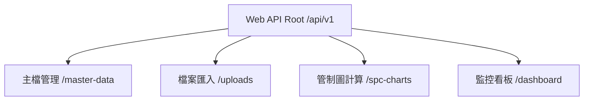

# SPC 品質管理系統 API 規格書 (API Contract)

本規格書記載系統提供之前端 Web API 及自動化機台資料上報 API。所有請求與回應均採用 `application/json`，並且統一遵循 RESTful 設計準則。

---

## 1. 共通回應結構 (Standard API Response Wrapper)

為了確保前端統一處理例外與狀態，所有 API 回應均包裝於以下標準結構：

```json
{
  "success": true,
  "message": "請求處理成功",
  "data": { ... },
  "errorCode": null,
  "timestamp": "2026-05-17T08:30:00Z"
}
```

---

## 2. 核心端點清單 (Endpoint Inventory)



### 2.1 主檔管理 (Master Data API)

#### 取得檢驗項目關聯清單
`GET /api/v1/master-data/part-process-characteristics?partId=1&processId=1`
- **權限**：需 JWT 驗證。
- **回應內容**：回傳符合條件的 `PartProcessCharacteristic` 項目，包含上下規格界限與抽樣大小。

#### 建立或更新檢驗項目關聯
`POST /api/v1/master-data/part-process-characteristics`
```json
{
  "partId": 1,
  "processId": 1,
  "characteristicId": 10,
  "usl": 10.5,
  "lsl": 9.5,
  "targetValue": 10.0,
  "sampleSize": 5,
  "chartTypeId": 1,
  "ruleGroupId": 1
}
```

---

### 2.2 兩階段檔案上傳與確認 (Two-Stage Upload API)

#### 階段 1：上傳並進行校驗預覽
`POST /api/v1/uploads/staged`
- **Content-Type**：`multipart/form-data`
- **參數**：`file` (二進位串流), `uploadType` (字串, `Variable` / `Attribute`).
- **回應內容**：回傳 `uploadBatchId`、校驗結果統計與錯誤明細 (詳見匯入規範)。

#### 階段 2：確認寫入並執行 SPC 計算
`POST /api/v1/uploads/confirm/{uploadBatchId}`
- **參數**：`uploadBatchId` (Guid, 來自階段 1 回傳的 ID)。
- **回應內容**：回傳匯入成功筆數與觸發的異常警報總數。

---

### 2.3 管制圖計算與即時繪圖 (Control Charts API)

#### 取得動態管制圖運算資料
`GET /api/v1/spc-charts/calculate?partId=1&processId=1&characteristicId=10&startDate=2026-05-01&endDate=2026-05-17`
- **回應內容**：

```json
{
  "success": true,
  "data": {
    "chartType": "XBAR_R",
    "capability": {
      "cp": 1.45,
      "cpk": 1.38,
      "pp": 1.42,
      "ppk": 1.35,
      "sigmaWithin": 0.23,
      "sigmaOverall": 0.24
    },
    "limits": {
      "usl": 10.5, "lsl": 9.5, "target": 10.0,
      "cl": 10.02, "ucl": 10.35, "lcl": 9.69
    },
    "chartData": {
      "points": [
        {
          "measuredAt": "2026-05-17T08:30:00",
          "mean": 10.15,
          "range": 0.12,
          "outOfSpec": false,
          "outOfControl": false,
          "violatedRules": []
        }
      ]
    }
  }
}
```

---

### 2.4 即時監控看板 (Dashboard API)

#### 取得首頁 Dashboard 匯總數據
`GET /api/v1/dashboard/summary`
- **回應內容**：

```json
{
  "success": true,
  "data": {
    "todayAlertsCount": 5,
    "unacknowledgedAlertsCount": 3,
    "cpkRankings": [
      { "partName": "P-1001", "processName": "ST-01", "charName": "長度", "cpk": 0.85, "status": "Danger" },
      { "partName": "P-1002", "processName": "ST-02", "charName": "厚度", "cpk": 1.55, "status": "Excellent" }
    ],
    "topDefectiveMachines": [
      { "machineCode": "M-01", "machineName": "研磨機A", "alertCount": 12 },
      { "machineCode": "M-03", "machineName": "鑽孔機B", "alertCount": 8 }
    ],
    "topDefectiveProcesses": [
      { "processCode": "ST-01", "processName": "第一道切削", "alertCount": 15 }
    ]
  }
}
```

#### 取得即時警報跑馬燈清單
`GET /api/v1/dashboard/recent-alerts?top=10`
- **回應內容**：回傳最新 10 筆 `AlertEvent` 事件，包含異常類型、發生時間與說明。
