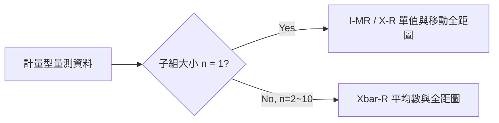
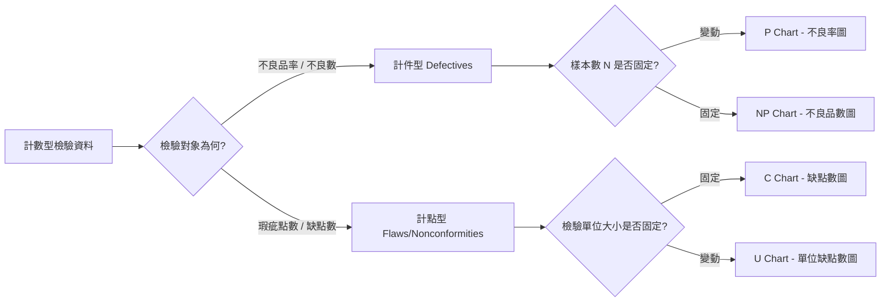

# 六大管制圖公式與計算規範 (Control Charts Mathematical Reference)

本文件詳細記載本系統所支援的六種管制圖計算邏輯，分為計量型 (Variable) 與計數型 (Attribute) 兩大類。

---

## 1. 計量型管制圖 (Variable Control Charts)

### 1.1 Xbar-R 管制圖 (平均數與全距圖)
適用於現場定時定量進行子組抽樣（如每 2 小時抽 5 樣品，$n=5$）的連續數值檢驗。

#### 符號與基本計算
- 子組平均值：$\bar{X} = \frac{1}{n}\sum_{i=1}^n X_i$
- 子組全距：$R = X_{max} - X_{min}$
- 總體平均數：$\bar{\bar{X}} = \frac{1}{k}\sum_{j=1}^k \bar{X}_j$ ($k$ 為子組總數)
- 全距平均數：$\bar{R} = \frac{1}{k}\sum_{j=1}^k R_j$

#### 管制界限公式
- **$\bar{X}$ 圖**：
  $$UCL_{\bar{X}} = \bar{\bar{X}} + A_2 \bar{R}$$
  $$CL_{\bar{X}} = \bar{\bar{X}}$$
  $$LCL_{\bar{X}} = \bar{\bar{X}} - A_2 \bar{R}$$
- **$R$ 圖**：
  $$UCL_R = D_4 \bar{R}$$
  $$CL_R = \bar{R}$$
  $$LCL_R = D_3 \bar{R}$$ (若 $n \le 6$，$D_3 = 0$，則 $LCL_R$ 設為 0 或不設)

### 1.2 X-R / I-MR 管制圖 (單值與移動全距圖)
適用於破壞性檢驗、檢驗成本極高、或製程產出緩慢，導致子組大小 $n=1$ 的情境。

#### 符號與基本計算
- 觀測單值序列：$X_1, X_2, ..., X_N$
- 單值總平均：$\bar{X} = \frac{1}{N}\sum_{i=1}^N X_i$
- 移動全距 (Moving Range)：$MR_i = |X_i - X_{i-1}|$ ($i=2\sim N$)
- 平均移動全距：$\bar{MR} = \frac{1}{N-1}\sum_{i=2}^N MR_i$

#### 管制界限公式 (查表採用 $n=2$ 之常數)
- **單值 $X$ 圖**：
  $$UCL_X = \bar{X} + 2.66 \cdot \bar{MR} \quad (\text{推導自 } E_2 = 3/d_2 = 3/1.128 \approx 2.66)$$
  $$CL_X = \bar{X}$$
  $$LCL_X = \bar{X} - 2.66 \cdot \bar{MR}$$
- **移動全距 $MR$ 圖**：
  $$UCL_{MR} = D_4 \cdot \bar{MR} = 3.267 \cdot \bar{MR}$$
  $$CL_{MR} = \bar{MR}$$
  $$LCL_{MR} = D_3 \cdot \bar{MR} = 0$$

---

## 2. 計數型管制圖 (Attribute Control Charts)

### 2.1 P Chart (不良率管制圖)
適用於檢驗總樣本數 $n_i$ 變動的每批次不良品比率管制。
- 第 $i$ 批不良率：$p_i = \frac{D_i}{n_i}$ ($D_i$ 為不良數)
- 平均不良率：$\bar{p} = \frac{\sum D_i}{\sum n_i}$
- **界限公式** (針對第 $i$ 批)：
  $$UCL_i = \bar{p} + 3\sqrt{\frac{\bar{p}(1-\bar{p})}{n_i}}$$
  $$CL = \bar{p}$$
  $$LCL_i = \max\left(0, \bar{p} - 3\sqrt{\frac{\bar{p}(1-\bar{p})}{n_i}}\right)$$

### 2.2 NP Chart (不良品數管制圖)
適用於每批抽樣檢驗總數 $n$ 固定的情境。
- 平均不良品數：$n\bar{p} = \frac{\sum D_i}{k}$
- **界限公式**：
  $$UCL = n\bar{p} + 3\sqrt{n\bar{p}(1-\bar{p})}$$
  $$CL = n\bar{p}$$
  $$LCL = \max\left(0, n\bar{p} - 3\sqrt{n\bar{p}(1-\bar{p})}\right)$$

### 2.3 C Chart (缺點數管制圖)
適用於固定受檢面積、長度或單位產品上（例如一塊標準尺寸 PCB 板）的總瑕疵點數 $c_i$ 管制。
- 平均缺點數：$\bar{c} = \frac{\sum c_i}{k}$
- **界限公式** (基於卜瓦松分配 Poisson Distribution)：
  $$UCL = \bar{c} + 3\sqrt{\bar{c}}$$
  $$CL = \bar{c}$$
  $$LCL = \max\left(0, \bar{c} - 3\sqrt{\bar{c}}\right)$$

### 2.4 U Chart (單位缺點數管制圖)
適用於受檢單位大小 $n_i$ 變動（例如不同批次布料平方米數不同）的單位缺點數 $u_i = \frac{c_i}{n_i}$ 管制。
- 平均單位缺點數：$\bar{u} = \frac{\sum c_i}{\sum n_i}$
- **界限公式** (針對第 $i$ 批)：
  $$UCL_i = \bar{u} + 3\sqrt{\frac{\bar{u}}{n_i}}$$
  $$CL = \bar{u}$$
  $$LCL_i = \max\left(0, \bar{u} - 3\sqrt{\frac{\bar{u}}{n_i}}\right)$$
