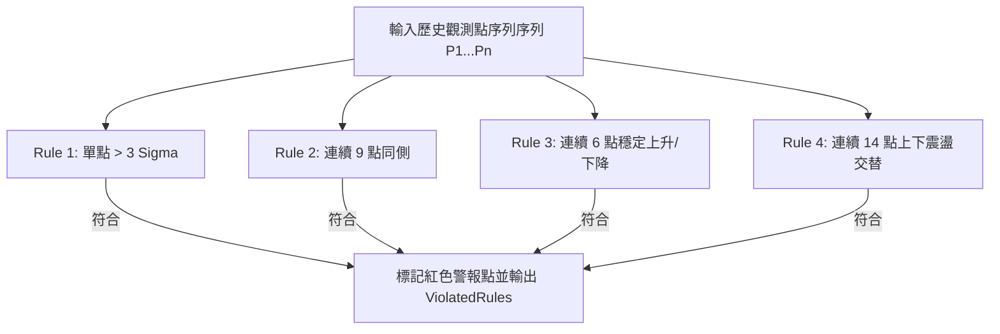

# 西方電氣規則異常判定手冊 (Western Electric Rules Specification)

本文件詳細定義本系統支援的 Western Electric Rules (西方電氣規則) 異常判定邏輯。西方電氣規則是製造品質系統中，用於偵測製程是否處於統計不穩定狀態 (Out of Control) 的國際黃金標準。

---

## 1. 規則分佈與劃分區間 (Zone Division)

管制圖中心線為 $CL$ ($\mu$)，標準差為 $\sigma$。從中心線向上下延伸，可將上下方各劃分為三個區域：
- **Zone C**：位於中心線 $CL$ 與 $\pm 1\sigma$ 之間。
- **Zone B**：位於 $\pm 1\sigma$ 與 $\pm 2\sigma$ 之間。
- **Zone A**：位於 $\pm 2\sigma$ 與 $\pm 3\sigma$ ($UCL/LCL$) 之間。

```
+3 Sigma (UCL) -------------------------------------
              | Zone A
+2 Sigma       -------------------------------------
              | Zone B
+1 Sigma       -------------------------------------
              | Zone C
Center (CL)   -------------------------------------
              | Zone C
-1 Sigma       -------------------------------------
              | Zone B
-2 Sigma       -------------------------------------
              | Zone A
-3 Sigma (LCL) -------------------------------------
```

---

## 2. 核心支援的四大規則詳細定義 (The 4 Western Electric Rules)



### 2.1 Rule 1: 超過 $3\sigma$ (Single Point Out of Control Limits)
- **判定條件**：單一資料點落在中心線之 $\pm 3\sigma$ 界限之外（亦即大於 $UCL$ 或小於 $LCL$）。
- **統計意義**：反映製程發生突發性、劇烈的大幅變異，可能因為原物料批次錯誤、機台當機、設定參數嚴重失誤等特殊原因 (Special Cause)。

### 2.2 Rule 2: 連續 9 點同側 (Shift in Process Mean)
- **判定條件**：連續 9 個資料點落在中心線 $CL$ 的同一側（全部 $> CL$ 或全部 $< CL$）。若資料點剛好等於 $CL$，則忽略該點不做計算。
- **統計意義**：表示製程平均值已發生系統性偏移 (Shift)。可能的原因包括機台零組件老化磨損、量測儀器失去準度、或更換不同特性的耗材。

### 2.3 Rule 3: 連續 6 點上升或下降 (Process Trend)
- **判定條件**：連續 6 個資料點呈現單調遞增 ($X_i < X_{i+1} < ... < X_{i+5}$) 或單調遞減 ($X_i > X_{i+1} > ... > X_{i+5}$)。
- **統計意義**：表示製程正在產生趨勢性漂移 (Trend)。常見於化學槽液濃度漸進耗損、刀具漸進式磨損、或環境室溫/濕度持續改變。

### 2.4 Rule 4: 連續 14 點交替 (Systematic Alternation)
- **判定條件**：連續 14 個資料點呈現上下交替跳動 ($X_1 < X_2 > X_3 < X_4 > ...$)。
- **統計意義**：反映製程中存在週期性的變異來源。例如操作員分兩班交替輪班習慣不同、雙主軸機台交互加工、或溫控系統啟閉過於頻繁的震盪。

---

## 3. 演算法實作指引 (Implementation Guidance)
在 `WesternElectricRulesValidator.cs` 中，應採用滑動視窗 (Sliding Window) 遍歷測量點。

```csharp
// 虛擬碼範例
public static List<string> CheckWesternElectricRules(List<SpcDataPoint> points, double mean, double sigma, int index)
{
    var violations = new List<string>();
    var current = points[index].Value;

    // Rule 1: > 3 sigma
    if (Math.Abs(current - mean) > 3 * sigma) violations.Add("Rule1_Over3Sigma");

    // Rule 2: 9 points same side
    if (index >= 8) {
        var sign = Math.Sign(current - mean);
        if (sign != 0 && points.GetRange(index - 8, 9).All(p => Math.Sign(p.Value - mean) == sign)) {
            violations.Add("Rule2_9SameSide");
        }
    }

    // Rule 3: 6 points trend
    if (index >= 5) {
        var window = points.GetRange(index - 5, 6).Select(p => p.Value).ToList();
        bool inc = true, dec = true;
        for(int k=0; k<5; k++) {
            if(window[k] >= window[k+1]) inc = false;
            if(window[k] <= window[k+1]) dec = false;
        }
        if(inc || dec) violations.Add("Rule3_6Trend");
    }

    // Rule 4: 14 points alternating
    if (index >= 13) {
        bool alt = true;
        for (int k = index - 13; k < index; k++) {
            var diff1 = points[k].Value - points[k-1].Value;
            var diff2 = points[k+1].Value - points[k].Value;
            if (diff1 * diff2 >= 0) { alt = false; break; }
        }
        if(alt) violations.Add("Rule4_14Alternating");
    }

    return violations;
}
```
