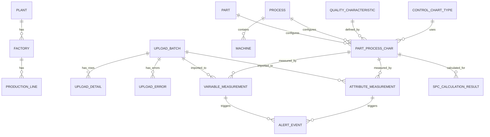

# SPC 品質管理系統資料庫設計 (Database Schema Design)

本系統採用 Microsoft SQL Server 作為持久化儲存層，運用 Entity Framework Core 進行 Code-First 管理。針對工業大數據場景，設計了清晰的主檔層、資料收集與校驗層、計算與警報層。

---

## 1. 實體關聯圖 (ER Diagram)

---

## 2. 核心實體結構與欄位定義 (Core Tables & Schemas)

### 2.1 企業組織架構表
- **`Plants` (廠區)**：`Id` (int, PK), `PlantCode` (nvarchar(50), UK), `PlantName` (nvarchar(100)).
- **`Factories` (廠房)**：`Id` (int, PK), `PlantId` (int, FK), `FactoryCode` (nvarchar(50), UK), `FactoryName` (nvarchar(100)).
- **`ProductionLines` (產線)**：`Id` (int, PK), `FactoryId` (int, FK), `LineCode` (nvarchar(50), UK), `LineName` (nvarchar(100)).

### 2.2 品質與工藝設定表 (Master Data)
- **`Parts` (料號/產品)**：`Id` (int, PK), `PartNo` (nvarchar(50), UK), `PartName` (nvarchar(100)), `Specification` (nvarchar(200)).
- **`Processes` (製程工站)**：`Id` (int, PK), `ProcessCode` (nvarchar(50), UK), `ProcessName` (nvarchar(100)).
- **`Machines` (機台設備)**：`Id` (int, PK), `MachineCode` (nvarchar(50), UK), `MachineName` (nvarchar(100)), `ProcessId` (int, FK).
- **`QualityCharacteristics` (品質特性/檢驗項目)**：`Id` (int, PK), `CharacteristicCode` (nvarchar(50), UK), `CharacteristicName` (nvarchar(100)), `DataCategory` (nvarchar(20)) [Variable/Attribute], `Unit` (nvarchar(20)).
- **`ControlChartTypes` (管制圖類型)**：`Id` (int, PK), `ChartTypeCode` (nvarchar(50), UK) [XBAR_R, I_MR, P, NP, C, U], `ChartTypeName` (nvarchar(100)).
- **`PartProcessCharacteristics` (料號製程檢驗項目設定表 - 核心關聯)**：
  - `Id` (int, PK)
  - `PartId`, `ProcessId`, `CharacteristicId` (int, FK, 聯合 UK 確保唯一性)
  - `USL`, `LSL`, `TargetValue` (float, null) - 規格界限
  - `UCL`, `CL`, `LCL` (float, null) - 基準管制界限
  - `SampleSize` (int, 預設 1) - 子組抽樣大小
  - `ChartTypeId` (int, FK) - 綁定管制圖類型
  - `RuleGroupId` (int, FK) - 綁定西方電氣規則組

### 2.3 兩階段資料匯入與暫存表 (Two-Stage Staging Tables)
- **`UploadBatches` (上傳批次總表)**：`UploadBatchId` (uniqueidentifier, PK), `UploadType` (nvarchar(20)), `SourceType` (nvarchar(50)), `ImportStatus` (nvarchar(20)) [Uploaded, Validating, Validated, Confirmed, Failed], `OriginalFileName`, `TotalRows`, `ValidRows`, `ErrorRows`, `ConfirmedAt`.
- **`UploadDetails` (上傳資料列明細)**：`Id` (bigint, PK), `UploadBatchId` (guid, FK), `RowNo` (int), `PayloadJson` (nvarchar(max)) [儲存未解析的原始欄位], `IsValid` (bit).
- **`UploadErrors` (上傳校驗錯誤日誌)**：`Id` (bigint, PK), `UploadBatchId` (guid, FK), `UploadDetailId` (bigint, null), `RowNo` (int), `FieldName` (nvarchar(50)), `ErrorCode`, `ErrorMessage`.

### 2.4 品質測量與收集表 (Measurement Tables)
- **`VariableMeasurements` (計量型測量資料)**：
  - `Id` (bigint, PK)
  - `UploadBatchId` (guid, FK)
  - `PartId`, `ProcessId`, `MachineId`, `CharacteristicId`, `PartProcessCharacteristicId` (int, FK)
  - `LotNo`, `WorkOrderNo`, `SerialNo` (nvarchar(50))
  - `SampleNo` (int) - 子組內的樣本編號
  - `MeasuredValue` (float) - 精確測量數值
  - `MeasuredAt` (datetime2, index)
  - `Operator` (nvarchar(50))
- **`AttributeMeasurements` (計數型測量資料)**：
  - `Id` (bigint, PK)
  - `UploadBatchId` (guid, FK)
  - `PartId`, `ProcessId`, `MachineId`, `CharacteristicId`, `PartProcessCharacteristicId` (int, FK)
  - `LotNo`, `WorkOrderNo` (nvarchar(50))
  - `SampleNo` (int)
  - `InspectedQty` (int, null) - 總檢驗數 (用於 P, NP)
  - `DefectQty` (int, null) - 不良品數量 (用於 P, NP)
  - `DefectCount` (int, null) - 缺點數 (用於 C, U)
  - `UnitCount` (int, null) - 單位數量 (用於 U)
  - `MeasuredAt` (datetime2, index)

### 2.5 計算結果與即時警報表 (Calculation & Alert Tables)
- **`SpcCalculationResults` (SPC 運算結果快照)**：`Id` (bigint, PK), `UploadBatchId`, `DataCategory`, `PartProcessCharacteristicId`, `ChartTypeId`, `StatisticName`, `StatisticValue`, `USL`, `LSL`, `UCL`, `CL`, `LCL`, `IsOutOfSpec`, `IsOutOfControl`, `ViolatedRulesJson`, `CalculatedAt`.
- **`AlertEvents` (品質警報事件總表)**：`Id` (bigint, PK), `OccurredAt` (datetime2), `ProductId`, `StationId`, `InspectionItemId` (對應 Part, Process, Characteristic), `ActualValue`, `AlertType` [OutOfSpec, OutOfControl, WesternElectricRule], `Message`, `BatchId`, `IsAcknowledged`, `Status` [Open, Investigating, Closed], `RootCause`, `CorrectiveAction`, `ResponsibleUser`, `ClosedAt`.

---

## 3. 資料庫索引與效能優化策略 (Indexing & Performance Tuning)
為了確保在高頻率寫入與大規模運算時不發生鎖表或查詢卡頓，設計以下索引：
1. **複合查詢索引 (Composite Index)**：在 `VariableMeasurements` 與 `AttributeMeasurements` 上建立 `IX_Measurements_Part_Process_Machine_Char_Date (PartId, ProcessId, MachineId, CharacteristicId, MeasuredAt DESC)`，支援快速撈取最近 $N$ 批子組進行管制圖運算。
2. **批次關聯索引**：在 `UploadDetails` 及 `UploadErrors` 上針對 `UploadBatchId` 建立非叢集索引 (Non-Clustered Index)，加速分頁校驗與預覽速度。
3. **警報狀態索引**：在 `AlertEvents` 建立 `IX_AlertEvents_Status_OccurredAt (Status, OccurredAt DESC)`，確保首頁 Dashboard 載入當日未處理警報在 50ms 內完成。

---

## 4. 併發與刪除控制 (Concurrency & Soft Delete)
- **樂觀鎖 (Optimistic Concurrency)**：所有主檔與警報表均繼承 `BaseEntity`，並啟用 `[Timestamp] public byte[]? RowVersion { get; set; }`。當多位主管同時簽核異常單 (CAPA) 或更改管制界限時，若發生碰撞將拋出 `DbUpdateConcurrencyException`。
- **軟刪除 (Soft Delete)**：透過 EF Core 全域查詢篩選器 (Global Query Filter) `modelBuilder.Entity<T>().HasQueryFilter(e => !e.IsDeleted)`，保護歷史稽核軌跡不被物理刪除。
