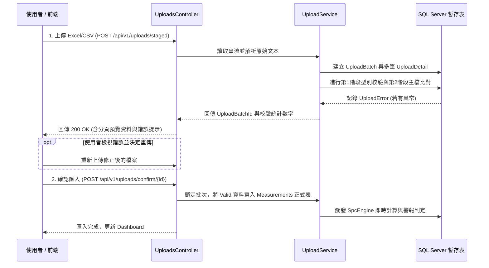

# 現場量測資料匯入與防呆規範 (Data Import Specification)

本文件規範 Excel 與 CSV 檔案匯入的標準資料格式、兩階段非同步校驗機制、以及錯誤回饋格式。

---

## 1. 兩階段匯入架構 (Two-Stage Validation Workflow)



---

## 2. 標準檔案格式定義 (Standard File Formats)

### 2.1 計量型資料 (Variable Measurement)
支援多樣本數值橫向展開或單值列表。必須包含標準表頭。

**CSV/Excel 欄位順序與名稱規範**：
`日期,工單,料號,製程,機台,檢驗項目,測量值`

**範例**：
```csv
日期,工單,料號,製程,機台,檢驗項目,測量值
2026-05-17 08:30:00,WO-20260501,P-1001,ST-01,M-01,LEN-001,10.05
2026-05-17 08:30:00,WO-20260501,P-1001,ST-01,M-01,LEN-001,10.03
2026-05-17 08:30:00,WO-20260501,P-1001,ST-01,M-01,LEN-001,10.08
2026-05-17 10:30:00,WO-20260501,P-1001,ST-01,M-01,LEN-001,10.12
```

### 2.2 計數型資料 (Attribute Measurement)
針對每批次或每日的檢驗數量與不良統計。

**CSV/Excel 欄位順序與名稱規範**：
`日期,Lot,不良數,總數`

**範例**：
```csv
日期,Lot,不良數,總數
2026-05-17 08:00,L-001,5,1000
2026-05-17 12:00,L-002,12,1500
2026-05-17 16:00,L-003,3,1200
```

---

## 3. 校驗規則與錯誤代碼 (Validation Rules & Error Codes)

在第 1 階段（格式與型態）與第 2 階段（業務主檔），若未通過檢驗，將在 `UploadErrors` 寫入以下代碼：

| 錯誤代碼 (ErrorCode) | 錯誤說明 (ErrorMessage) | 防呆層級 | 系統處置 |
| :--- | :--- | :---: | :--- |
| **`ERR_DATETIME_INVALID`** | 日期格式無法解析 (需為 YYYY-MM-DD HH:mm:ss)。 | 第 1 階段 | 該筆紀錄標記 `IsValid = false`。 |
| **`ERR_VALUE_NOT_NUMERIC`** | 測量數值或數量非有效數字。 | 第 1 階段 | 該筆紀錄標記 `IsValid = false`。 |
| **`ERR_PART_NOT_FOUND`** | 系統中無此料號代碼 (`PartNo`)。 | 第 2 階段 | 該筆紀錄標記 `IsValid = false`。 |
| **`ERR_PROCESS_NOT_FOUND`**| 系統中無此製程工站 (`ProcessCode`)。 | 第 2 階段 | 該筆紀錄標記 `IsValid = false`。 |
| **`ERR_CHAR_NOT_FOUND`** | 系統中無此檢驗項目 (`CharacteristicCode`)。 | 第 2 階段 | 該筆紀錄標記 `IsValid = false`。 |
| **`ERR_CONFIG_MISSING`** | 料號+製程+檢驗項目之關聯設定不存在 (`PartProcessCharacteristic`)。 | 第 2 階段 | 該筆紀錄標記 `IsValid = false`。 |

---

## 4. 預覽與錯誤提示資料合約 (Preview Response Contract)

前端呼叫預覽 API 取得的 JSON 格式如下：

```json
{
  "uploadBatchId": "c56a4180-65aa-42ec-a945-5fd21dec0538",
  "originalFileName": "quality_report_202605.xlsx",
  "importStatus": "Validated",
  "totalRows": 250,
  "validRows": 248,
  "errorRows": 2,
  "errors": [
    {
      "rowNo": 14,
      "fieldName": "料號",
      "errorCode": "ERR_PART_NOT_FOUND",
      "errorMessage": "系統中無此料號代碼 'P-9999'"
    },
    {
      "rowNo": 89,
      "fieldName": "測量值",
      "errorCode": "ERR_VALUE_NOT_NUMERIC",
      "errorMessage": "測量數值 '10.0A' 非有效數字"
    }
  ],
  "previewData": [
    {
      "rowNo": 1,
      "payloadJson": "{\"日期\":\"2026-05-17 08:30:00\",\"料號\":\"P-1001\",\"測量值\":\"10.05\"}",
      "isValid": true
    }
  ]
}
```
