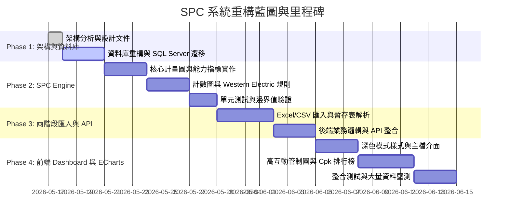

# SPC + MES 系統重構執行計畫 (Refactoring Plan)

本重構計畫採用敏捷迭代與逐步替換（Strangler Fig Pattern）架構，確保現有業務不中斷的同時，逐步完成工業級 SPC 系統升級。

---

## 1. 里程碑與時程規劃 (Milestones & Timeline)

---

## 2. 各階段詳細執行步驟 (Detailed Execution Phases)

### Phase 1: 基礎架構與資料庫重構 (Infrastructure & DB Refactoring)
1. **完成設計文件**：產出所有 `/ai_docs` 系統設計與規格書。
2. **清理現有模型**：檢視 `Domain/Entities/Models.cs`，整合 `Plant`, `Factory`, `Part`, `Process`, `Machine`, `QualityCharacteristic`, `PartProcessCharacteristic` 等核心主檔。
3. **擴建測量與暫存表**：建立用於兩階段匯入的 `UploadBatch`, `UploadDetail`, `UploadError` 結構，以及分離的 `VariableMeasurement` (計量) 與 `AttributeMeasurement` (計數) 資料表。
4. **資料庫遷移**：產生 Entity Framework Core 遷移檔，確保在 SQL Server 順利建表與佈署種子資料。

### Phase 2: SPC Engine 深度解耦與擴充 (SPC Engine Deep Decoupling & Expansion)
1. **重構數學模型**：在 `SpcEngine/Models` 中定義標準化輸入 `Subgroup`、`VariableDataPoint`、`AttributeDataPoint` 與計算結果 `ControlChartResult`、`CapabilityResult`。
2. **常數與查表模組**：完善 `SpcConstants.cs`，提供 $n=2\sim 25$ 的 $A_2, D_3, D_4, d_2, c_4$ 等常數。
3. **實作計量圖與製程能力**：完成 `XbarRChartCalculator`、`ImrChartCalculator`，並新增 `ProcessCapabilityCalculator` 算出精確的 Cp, Cpk, Pp, Ppk。
4. **實作計數圖**：完善 `AttributeChartCalculator` (P, NP, C, U 圖)。
5. **升級規則引擎**：將 `NelsonRulesValidator` 升級改寫為支援 Western Electric Rules 的 `WesternElectricRulesValidator`，並支援可開關規則選項。

### Phase 3: 兩階段檔案匯入與後端 API 整合 (Two-Stage Upload & Backend Integration)
1. **上傳與解析服務 (`UploadService`)**：使用 `ClosedXML` 或 `ExcelDataReader` 解析 Excel/CSV，將原始資料轉入 `UploadDetail`。
2. **非同步校驗引擎**：對比資料庫主檔，標記缺失或異常欄位於 `UploadError`。
3. **確認與計算整合**：建立確認匯入 API，寫入測量表並呼叫 SPC Engine 進行即時計算與記錄結果 (`SpcCalculationResult`)，若有規格或管制異常觸發 `AlertEvent`。
4. **開放標準 RESTful API**：供前端及第三方機台傳送量測資料。

### Phase 4: 前端高互動展示與系統驗證 (Frontend Dashboard & Verification)
1. **UI 框架升級**：配置 Vue 3 + Tailwind CSS 的深色主題 (Dark Theme) 色票與全局共用元件。
2. **Dashboard 開發**：開發今日異常跑馬燈、Cpk 表現排行榜、機台異常排行榜等視覺化卡片。
3. **高互動管制圖封裝**：基於 ECharts 封裝 `SpcControlChart` 元件，提供規格線、管制線、異常點紅色閃爍標記、數據懸浮提示 (Tooltip) 與動態刷新功能。
4. **全面測試與驗證**：撰寫後端單元測試、API 整合測試、建立自動測試資料生成器，並以 10,000+ 筆資料進行大資料量壓測。

---

## 3. 風險管理與應對策略 (Risk Management & Mitigation)

| 風險項目 | 衝擊評估 | 發生機率 | 應對策略 |
| :--- | :---: | :---: | :--- |
| **數學公式與統計常數誤差** | 高 | 中 | 建立標準測試資料集 (以 Minitab 或 JMP 數據為基準)，進行精確度斷言比對。 |
| **大量測量資料寫入與運算卡頓** | 高 | 中 | SPC 運算純在內存執行；資料庫查詢採用分批加載 (Batch/Pagination) 與適當的複合索引。 |
| **Excel 檔案格式混亂或儲存格型態錯誤** | 中 | 高 | 在兩階段校驗的第 1 階段採用嚴格型別轉換，並在前端提供直覺的儲存格座標與紅框標註。 |
