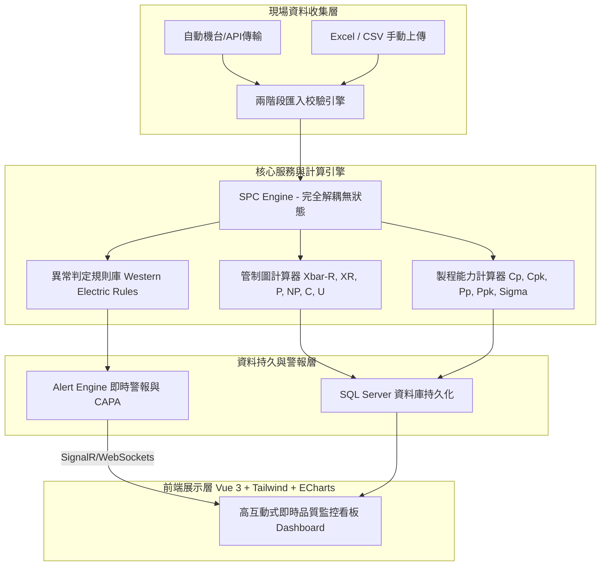

# 系統需求與專案現況分析 (System Requirements & Current Analysis)

## 1. 專案現況與痛點分析 (Current Status & Pain Points)
目前專案（MES + SPC MVP）雖然已具備部分基礎架構（如產品、工站、檢驗項目等主檔維護，以及簡單的 Xbar-R 管制圖顯示與 CSV 單一格式匯入），但在面對現代高科技或精密製造廠（如半導體、PCB、EMS）的品質管理需求時，仍屬於「一般 CRUD 網站」而非真正的「工業級品質系統」。

主要痛點如下：
1. **資料模型缺乏製造業真實情境**：目前雖然建立了一些新舊混雜的主檔（例如 `Plant`, `Factory`, `Part`, `Process`, `Machine`, `QualityCharacteristic` 等），但資料關聯並未完全打通，尤其在收集測量資料時，未強制關聯工單 (Work Order)、批號 (Lot No)、料號 (Part)、製程 (Process)、機台 (Machine)。
2. **SPC 計算引擎功能不足且過度耦合**：現有的 `SpcService` 和 `SpcEngine` 只具備簡單的 Xbar-R 及基礎 Attribute 管制圖計算，缺乏完整的製程能力指標（Cp, Cpk, Pp, Ppk）與估計標準差計算；且部分邏輯仍直接在 Service 層操作資料庫。
3. **異常判定規則不全**：現有 `NelsonRulesValidator` 僅有硬編碼的初步實作，缺乏針對製造業常用的 Western Electric Rules (西方電氣規則) 進行參數化與高靈敏度即時判讀。
4. **資料匯入彈性低**：僅支援單一固定格式的 CSV (`InspectionItemId`, `SampleNo`, `ValueNumeric`)，無法支援常見的現場 Excel 報表匯入，且缺乏「先預覽、校驗錯誤、再確認寫入」的兩階段防呆機制。
5. **Dashboard 與圖表互動性匱乏**：前端圖表缺乏高互動性的 Zoom-in/out、規格線拖曳對比、標準差區間（$\pm 1\sigma, \pm 2\sigma, \pm 3\sigma$）呈現，且無即時警報機制與多維度的 Cpk 排行看板。

---

## 2. 系統重構核心目標 (Core Refactoring Objectives)
重構的核心目標是打造一個**高解耦**、**高效能**、且符合**國際製造品質標準**的 SPC 系統架構。

---

## 3. 功能需求規格清單 (Functional Specification)

### 3.1 完整 SPC 資料模型 (SPC Domain Modeling)
- **製造組織架構**：廠區 (Plant) -> 廠房 (Factory) -> 產線 (Line) -> 班別 (Shift) / 作業員 (Operator)。
- **工藝與品質特性**：料號 (Part) -> 製程 (Process) -> 機台 (Machine) -> 檢驗特性 (Quality Characteristic)。
- **檢驗特性關聯設定 (PartProcessCharacteristic)**：每一組料號+製程+特性，需精確設定 USL, LSL, Target, UCL, CL, LCL, 管制圖類型 (Xbar-R, P 等) 及抽樣大小 (Sample Size)。
- **測量資料集**：計量型 (Variable Measurement) 與計數型 (Attribute Measurement)。

### 3.2 統計與製程能力計算引擎 (Statistical & Capability Engine)
- **計量型運算**：子組平均值 ($\bar{X}$)、子組全距 ($R$)、總平均 ($\bar{\bar{X}}$)、全距平均 ($\bar{R}$)、樣本標準差 ($s$)。
- **製程能力指標**：
  - 短期能力 (Within)：$C_p = \frac{USL - LSL}{6\hat{\sigma}_{within}}$ ($ \hat{\sigma}_{within} = \frac{\bar{R}}{d_2} $ 或 $ \frac{\bar{s}}{c_4} $)。
  - 短期偏離度：$C_{pk} = \min\left(\frac{USL - \bar{\bar{X}}}{3\hat{\sigma}_{within}}, \frac{\bar{\bar{X}} - LSL}{3\hat{\sigma}_{within}}\right)$。
  - 長期能力 (Overall)：$P_p = \frac{USL - LSL}{6\sigma_{overall}}$ ($ \sigma_{overall} $ 為全體樣本標準差)。
  - 長期偏離度：$P_{pk} = \min\left(\frac{USL - \bar{\bar{X}}}{3\sigma_{overall}}, \frac{\bar{\bar{X}} - LSL}{3\sigma_{overall}}\right)$。

### 3.3 六大管制圖計算器 (Control Chart Calculators)
- **計量管制圖**：Xbar-R (平均數-全距圖)、X-R / I-MR (單值-移動全距圖)。
- **計數管制圖**：P Chart (不良率圖)、NP Chart (不良數圖)、C Chart (缺點數圖)、U Chart (單位缺點數圖)。

### 3.4 Western Electric 異常判定規則引擎 (Out-of-Control Rules)
1. **Rule 1**：單一點落在 $3\sigma$ 界限之外 ($> UCL$ 或 $< LCL$)。
2. **Rule 2**：連續 9 點落在中心線同一側。
3. **Rule 3**：連續 6 點穩定上升或下降。
4. **Rule 4**：連續 14 點上下交替起伏。

### 3.5 兩階段檔案匯入與校驗 (Two-Stage File Import)
- **支援格式**：標準 Excel (`.xlsx`) 與 CSV。
- **流程防呆**：上傳 -> 後端解析與校驗 (檢驗料號、製程是否存在、數值是否正確) -> 儲存至暫存表 (`UploadBatch`, `UploadDetail`, `UploadError`) -> 前端呈現錯誤提示與分頁預覽 -> 確認匯入 (寫入正式表並觸發即時 SPC 計算與警報)。

### 3.6 高階即時監控看板 (Executive Dashboard)
- **今日異常即時列**：動態展示當日發生的 Out-of-Spec (規格超標) 與 Out-of-Control (管制異常)。
- **排行榜看板**：Cpk 排行榜 (揪出低能力製程)、異常機台 TOP 5、異常製程 TOP 5。
- **動態管制圖預覽**：可快速切換不同製程/機台的管制圖縮圖，點擊後展開為全功能互動圖表。

---

## 4. 非功能性與架構需求 (Non-Functional Requirements)
1. **極致解耦**：SPC Engine 必須設計為純 C# 函式庫 (`netstandard2.0` / `.net8.0`)，完全無依賴於 Entity Framework Core，確保極高運算速度與 100% 可測試性。
2. **大數據效能**：針對高頻率抽樣資料，資料庫需具備適當索引 (例如 `PartId, ProcessId, MachineId, CharacteristicId, MeasuredAt`)，並支援萬筆測量紀錄秒級算完的能力。
3. **高互動與視覺美學**：前端採用深色工業風 (Dark Mode) 設計系統，搭配 ECharts / ApexCharts 提供絲滑流暢的縮放與浮動提示。
