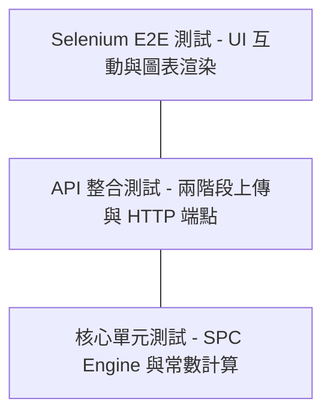
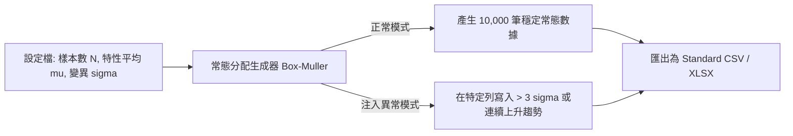

# SPC 系統全面品質保證與測試計畫 (Testing Strategy & Plan)

為了確保在重構過程中，SPC 計算引擎的統計準確度達到工業級標準，本專案將實施多層級測試金字塔 (Testing Pyramid)，涵蓋單元測試、API 整合測試、Selenium E2E 測試及大數據壓力測試。

---

## 1. 測試金字塔策略 (Test Pyramid)

### 1.1 核心單元測試 (Unit Testing)
- **測試目標**：針對 `SpcEngine` 下所有的 `Calculators` 與 `WesternElectricRulesValidator` 進行斷言驗證。
- **基準數據源**：以業界公認的統計軟體 (Minitab 19 或 JMP 16) 內建數據集為預期正確答案。
- **覆蓋率目標**：核心演算法與數學模組必須達到 95% 以上行覆蓋率與分支覆蓋率。
- **邊界案例 (Edge Cases)**：
  - 子組樣本數 $n=1, n=2, n=10, n=25, n > 25$ 時的計算器選擇與常數拋回。
  - 當 $n \le 6$ 時 $D_3 = 0$ 的處理。
  - 當所有數值相等 ($\bar{R} = 0, s = 0$) 時，除以零例外防護。

### 1.2 Web API 整合測試 (Integration Testing)
- **測試目標**：驗證 `UploadsController` 與 EF Core SQLite/SQL Server 記憶體內建庫的整合。
- **重點測試場景**：
  - 模擬 POST 二進位檔案，檢驗階段 1 回傳的 `TotalRows` 與 `ErrorRows` 是否與上傳的損壞檔案相符。
  - 模擬確認匯入後，呼叫 GET `spc-charts/calculate` 檢查是否成功寫入並返回正確的界限。

### 1.3 前端 Selenium E2E 自動化測試 (E2E Testing)
- **測試目標**：模擬真實使用者在瀏覽器上的操作行為。
- **測試腳本流程**：
  1. 登入系統並導覽至 `Dashboard`。
  2. 點擊「上傳量測檔案」按鈕，挑選測試用 `.xlsx`。
  3. 驗證彈出視窗是否顯示紅框標記錯誤列，並核實預覽表格資料是否出現。
  4. 點擊「確認匯入」，驗證首頁即時警報跑馬燈是否跳出新警報，且 Cpk 排行榜是否更新。
  5. 點擊圖表，驗證 ECharts 的 Zoom-in 與規格線顯示正常。

---

## 2. 自動化測試資料產生器 (Automated Test Data Generator)

為方便開發與壓測，將在 `tools/` 目錄建立 C# / Python 測試資料生成工具。

### 2.1 生成器功能規格
1. 支持基於 Box-Muller 變換算法生成指定 $\mu, \sigma$ 的常態分配隨機數。
2. 支持動態注入西方電氣異常模式：
   - 故意在第 100 筆資料寫入 $\mu + 3.5\sigma$ 的單值 (觸發 Rule 1)。
   - 故意在第 500~509 筆寫入比平均多 $0.5\sigma$ 的資料 (觸發 Rule 2)。
   - 故意在第 800~806 筆遞增 $0.2\sigma$ (觸發 Rule 3)。

---

## 3. 大量資料壓力測試 (Load & Stress Testing)

### 3.1 壓力測試指標
- **測試資料量**：單一品質特性 10,000 筆單值或 2,000 個子組 ($n=5$)。
- **預期效能指標 (SLA)**：
  - 後端 `XbarRChartCalculator` 讀取內存運算並返回 JSON 耗時 $< 50\text{ms}$。
  - 包含資料庫查詢的端到端 API 回應時間 $< 300\text{ms}$。
  - 前端 ECharts 載入 10,000 個 Canvas 點位且不發生卡頓 (60 FPS 拖曳縮放)。

### 3.2 壓測執行工具
使用 `k6` 或 `JMeter` 模擬多產線同時定時上報量測數值的併發情境，監控 ASP.NET Core 的記憶體用量與 SQL Server 執行緒等待狀態。
